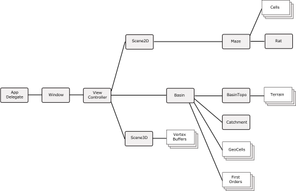

*Note: This project is just starting out so some of the ideas are half-baked at best.*

# Perrault
## Introduction
Perrault is a relatively simple simulation of a watershed.  It builds the catchment (details below), constructs the topography, and renders the result in either 2D or 3D.  It also can run a hydrologic simulation of the basin, routing the rainfall, estimating evapotranspiration, etc.  

> [Pierre Perrault](https://en.wikipedia.org/wiki/Pierre_Perrault_(scientist)) (1608-1680) was a French bureaucrat and scientist.  He is generally credited as the first to correctly describe the hydrologic cycle.  He maintained, against criticism, that the rainfall in the Parisian basin was sufficient to explain the rate of flow in the Seine.  He estimated the flow of the Seine and showed that the rainfall in the basin was more than sufficient to explain the flow in the Seine.

## Approach
The basic approach of this app is to describe the watershed as a rectangular mesh. The app uses a variant of the 4x4 seed-fill to determine the bounds of all the sub-basins (down to first order). A constuct named the "MazeRat" is then used to recursively walk the spanning tree. At each critical point, the Rat has a callback (provided by the caller) that allows the caller to use the Rat's info. The callback can be made when the Rat is ascending the tree or retracing its steps back down.

Due to the nature of the 4x4 seed fill, the algorithm used (*thank you Jack Bresenham*) has two important aspects or behaviours:

- If ascending is TRUE, then the callback function will be called ONCE and ONLY ONCE per cell in the part of the net visited
- If ascending is FALSE, then the call back function will be called ONCE per elm it is LEAVING (prevx,prevy) but will be called more than once for each cell (since many cells have more than one entrance/exit)

These callbacks have several applications: 

- a callback can be used to draw the spanning tree, i.e. the stream network for the 2D view
- a separate callback can be used to draw the spanning tree in the 3D view
- when the rat is ascending the tree it is guaranteed that each cell will be visited only once so the info is useful for topographical calculations
- when descending ("retracing steps") the data can be used to determine catchment area and other aspects of the morphology of the spanning tree, i.e the stream network
- the callbacks can be used to provide info for debugging

The construction of the watershed and stream follow the general pattern:

1. The Maze is instantiated, along with the rat.  
2. The Cells array, that holds the topological info about the Maze, is also instantiated and populated.
2. The Catchment object is instantiated, passed the Maze and the GeoCells arrays
3. The Rat is used to traverse the Maze, which builds the stream network, logging all the info on elevations, channel slope, etc. in the GeoCells array.
4. The BasinTopo object is instantiated and passed the Cells and GeoCells arrays. The arrays are then walked and the elevation of all the points with the Terrain array are computed. Note that the basic cell of the watershed are rectangular, but they are decomposed into triangles as part of this process.
5. Finally, the Scene3D object traverses the Terrain and GeoCells arrays to generate the vertices, normals and textures to pass to the GPU

After this, the user can choose one or more views of the result, including 3D, 2D and longitudinal profiles.

## Architecture

The diagram below shows the overall stucture of the architecture of Perrault 

## Modules

### View Controller
The view controller, derived from UIViewController. It owns the two views (View2D and View3D).  It also owns the the Basin itself, which in turn manages the cells, firstOrder and other Maze-related goodies.

### View2D
The two dimensional representation the Basin/Maze.  Based in Core Graphics it delineates the bounds of the cells which form the sub-basins. It also optionally can draw the spanning tree.

### View3D
The three-dimensional representation of the Basin/Maze. Based on SceneKit/UIKit, it depictss the Basin as a three-dimensional shape by inferring the topography of the basin from topogy and inferred slopes of the streams.

### Maze
The basic structure of the Maze.  Consists of an array of UInt8 cells.  Each of these is used as bit-flag where zeroes and indicate and open side to the cell and non-zero a closed facet.

### Rat
This object does the actual traversal of the maze/tree, using a variant of the 4x4 seed fill. 

### Basin
The object which manages all the objects which comprise the basin, including the Maze, GeoCells and FirstOrders.  

### BasinTopo
The object that constructs the actual topography. The BasinTopo object takes the Maze and the GeoCells and walks the basin to determine the height of the channels and interfluves.

## Data

### Cells
This array is a one-dimenstional array with the data being read and written to it by computing cell locations.  The type is UInt8

### GeoCells
This is a one-dimensional array (treated as two-dimensional) of objects representing the physical characteristics of the basin.  The object comprises:

    order    		// stream order of this cell, -1 means not set
    area     		// area of the sub-basin contributor
    chanLen  		// channel length below this cell
    exit        	// side on which stream exits cell
    chanElev    	// elev of channel, in maze units
    chanSlope		// slope of chanel, in maze units

### FirstOrders
This is a list of the cells in the basin that are "first order" basins, i.e. those which have no cells upstream  (*cf.* Lepold and Langbein).

### Vertex Buffers
These are the binary buffers which are constructed by the View3D, including position vertices, textures and normals.

## Functional Pieces

### allocMaze
Simply deletes the old maze, if necessary, and allocates a new one. This is typically called when the app is instantiated, but it is also called when the paramters of the Maze/Basin are changed.

### createMaze
This actually creates the maze by walking the spanning tree and setting the bounds of each cell, thus defining the Maze and, in turn, the stream network.

### deleteMaze
Delete the old mazze, cleaning up memory, resets the maze parameters.

### allocBasin
This is called when the basin is first created, but it is also called if the parameters (e.g. number of rows and columns) are changed, after the previous basin has been deleted.

### createBasin
This walks the Maze built in createMaze and builds

- the stream network
- the interfluves
- the morphology of the stream network

### deleteBasin
Deletes all the memory allocated for the Basin and any other system resources allocated during the application.

### traverseStreams
Provides facilities to walk the spanning tree created in the Maze. The traversal is guaranteed to visit each cell once and once only.  There are two modes:

- where the traversal calls the callback as it ascends the tree
- where the travesal calls the callback as it retraces its step down the tree