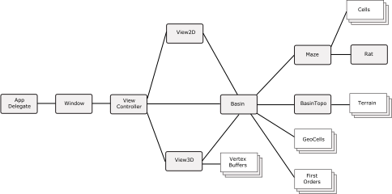

# Perrault
## Introduction
Perrault is a relatively simple simulation of a watershed.  It builds the catchment (details below), constructs the topography, and renders the result in either 2D or 3D.  It also can run a hydrologic simulation of the basin, routing the rainfall, estimating evapotranspiration, etc.  

[Pierre Perrault](https://en.wikipedia.org/wiki/Pierre_Perrault_(scientist)) (1608-1680) was a French bureaucrat and scientist.  He is generally credited as the first to correctly describe the hydrologic cycle.  He maintained, against criticism, that the rainfall was sufficient to explain the rate of flow in the Seine.  He estimated the flow of the Seine and showed that the rainfall in the basin was more than sufficient to explain the flow in the Seine.

## Approach
The basic approach is to describe the watershed as a rectangular mesh. The app uses a variant of the 4x4 seed-fill to determine the bounds of all the sub-basins (down to first order). A constuct named the "MazeRat" is then used to recursively walk the spanning tree. At each critical point, the Rat has a callback (provided by the caller) that allows the caller to use the Rat's info. The callback can be made when the Rat is ascending the tree or retracing its steps back down.

These callbacks have several applications: 

- the callback can be used to draw the spanning tree, i.e. the stream network
- the data from ascending and/or descending the tree can be used to determine morphology and other aspects of the spanning tree, i.e the stream network
- the callbacks can be used to provide info for debugging

The construction of the watershed and stream follow the general pattern:

1. The Maze is instantiated, along with the rat.  
2. The Cells array, that holds the topological info about the Maze, is also instantiated and populated.
2. The Catchment object is instantiated, passed the Maze and the GeoCells arrays
3. The Rat is used to traverse the Maze, which builds the stream network, logging all the info on elevations, channel slope, etc. in the GeoCells array.
4. The BasinTopo object is instantiated and passed the Cells and GeoCells arrays. The arrays are then walked and the elevation of all the points with the Terrain array are computed. Note that the basic cell of the watershed are rectangular, but they are decomposed into triangles as part of this process.
5. Finally, the Scene3D object traverses the Terrain and GeoCells arrays to generate the vertices, normals and textures to pass to the GPU

After this, the user can choose one or more views of the result, including 3D, 2D and longitudinal profiles.

## Architecture
The diagram below shows the overall stucture of the architecture of Perrault 

## Modules

### View Controller

### Scene2D

### Scene3D

### Maze

### Rat

### Basin

### BasinTopo

### Catchment

## Data

### Cells

### GeoCells

### FirstOrders

### Vertex Buffers